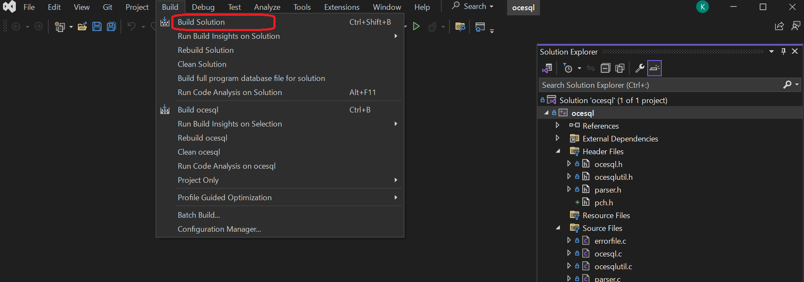

# Open COBOL ESQL 4J

Open COBOL ESQL 4J (OCESQL 4J) consits of open-source Embedded SQL pre-compiler and run time libraries for [opensource COBOL 4J](https://github.com/opensourcecobol/opensourcecobol4j).

# Supported software versions

* opensource COBOL 4J
  * 1.1.2 or later
* PostgreSQL
  * 9.6
  * 15
* OS
  * Ubuntu 24.04
  * Almalinux 9
* Java
  * OpenJDK 11

# Installation and Usage

## Requirements

* Open-source database.
  OCESQL 4J currently supports PostgreSQL database only.

* [opensource COBOL 4j](https://github.com/opensourcecobol/opensourcecobol4j) v1.1.12 or later.

* [sbt](https://www.scala-sbt.org/).


## Installation (Linux)

### Install opensource COBOL 4J

See [Installation guides of opensource COBOL 4J](https://github.com/opensourcecobol/opensourcecobol4j/wiki).

### Copy libcobj.jar

Copy libcobj.jar, which is the runtime library of opensource COBOL 4J, to `dblibj/lib/libcobj.jar`.
After you complete the installation procedure described in [Installation guides of opensource COBOL 4J](https://github.com/opensourcecobol/opensourcecobol4j/wiki), you can find libcobj.jar in `/usr/lib/opensourcecobol4j/`.

### sbt

See [the official Installation guide](https://www.scala-sbt.org/1.x/docs/Installing-sbt-on-Linux.html).

### Install Open COBOL ESQL 4J

Run the following commands.

```sh
./configure --prefix=/usr/
make
make install
```

Then, add `/usr/lib/Open-COBOL-ESQL-4J/ocesql4j.jar` to $CLASSPATH.

```sh
export CLASSPATH="$CLASSPATH":/usr/lib/Open-COBOL-ESQL-4J/ocesql4j.jar
```
## Installation (Windows)
### Install opensource COBOL 4J

See [README.md of opensource COBOL 4J](https://github.com/opensourcecobol/opensourcecobol4j/blob/develop/README.md).

### Copy libcobj.jar
Copy "libcobj.jar", generated by the installation of opensourcecobol4j, into "dblibj/lib".

### sbt
Download [here](https://www.scala-sbt.org/download/) and install it.

### Install Open COBOL ESQL 4J
#### Install Visual Studio
The Windows version of Open COBOL ESQL 4J uses the CL compiler included in Visual Studio 2022, so you must have [Visual Studio](https://visualstudio.microsoft.com/) installed beforehand.


#### Build a solution file
1. Download the complete set of files for opensource COBOL 4J.
2. Open win/ocesql.sln with Visual Studio.
3. Select "Debug" or "Release" mode.

4. Click "Build" -> "Build Solution".

After the build is completed, "cobj.exe" will be created in `win/x64/Debug` or `win/x64/Release`.

#### Build Scala Files
2. Open PowerShell.

3. Move to "dblibj" directory.
   ```
    cd dblibj
   ```
4. Execute the following command.
   ```
   sbt assembly
   ```

#### Place files in the appropriate location
1. If you build in Debug mode, change the 5th line of "win/install.ps1" from `\x64\Release\cobj.exe` to `\x64\Debug\cobj.exe`.
2. Open PowerShell
3. Move to "win" directory and execute "install.ps1".  
    ```
    cd win
    .\install.ps1
    ```
* Each file is placed in the following location. 

    | File name | Location |
    |---|---|
    | ocesql.exe | C:\ocesql4j\bin |
    | ocesql4j.jar | C:\ocesql4j\lib |

*  If you want to change the location of the files, modify "install.ps1".

#### Set the environment variables
1. Add C:\ocesql4j\bin to "PATH".
2. Add C:\ocesql4j\lib\ocesql4j.jar to "CLASSPATH".