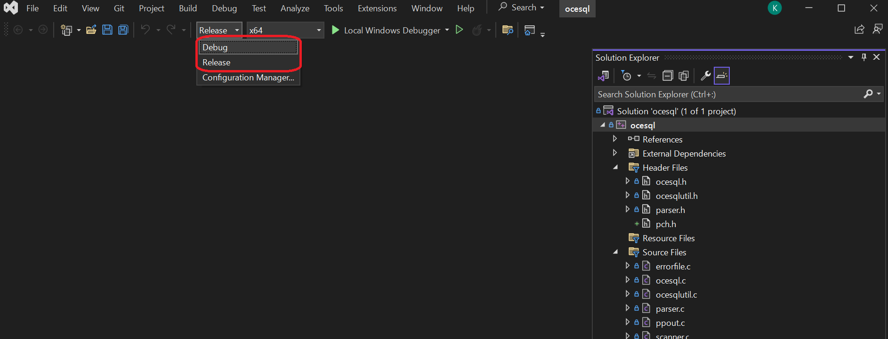

# Open COBOL ESQL 4J

[English version README](./README.md)

Open COBOL ESQL 4Jは[opensource COBOL 4J](https://github.com/opensourcecobol/opensourcecobol4j)向けの埋め込みSQLで、
埋め込みSQLプリコンパイラと実行時ライブラリで構成されています。

# サポートされているソフトウェアのバージョン

* opensource COBOL 4J
  * 1.1.2 or later
* PostgreSQL
  * 9.6
  * 15
* OS
  * Ubuntu 24.04
  * Almalinux 9
* Java
  * OpenJDK 11

# インストール方法と使用方法

## 必須ソフトウェア

* PostgreSQLデータベース

* [opensource COBOL 4J](https://github.com/opensourcecobol/opensourcecobol4j) v1.1.2またはそれ以降。

* [sbt](https://www.scala-sbt.org/).


## インストール(Linux)

### opensource COBOL 4Jをインストールする

[opensource COBOL 4JのREADME.md](https://github.com/opensourcecobol/opensourcecobol4j/blob/develop/README_JP.md)を参照してください。

### Open COBOL ESQL 4Jのダウンロード

下記のコマンドを実行してOpen COBOL ESQL 4Jをダウンロードします。

```sh
curl -L -o Open-COBOL-ESQL-4j-v1.1.1.tar.gz https://github.com/opensourcecobol/Open-COBOL-ESQL-4j/archive/refs/tags/v1.1.1.tar.gz
tar zxvf Open-COBOL-ESQL-4j-v1.1.1.tar.gz
# If you don't need the downloaded file, you can delete it.
rm Open-COBOL-ESQL-4j-v1.1.1.tar.gz
```

### jarファイルの準備

下記の2つのjarファイルを用意します。

#### `libcobj.jar`

下記のコマンドを実行してください。

```sh
cd Open-COBOL-ESQL-4j-1.1.1/
cp /usr/lib/opensourcecobol4j/libcobj.jar dblibj/lib/
```

opensource COBOL 4Jをインストール済みの場合、既に`/usr/lib/opensourcecobol4j/libcobj.jar`が存在します。
`find /usr/lib/ -name libcobj.jar`を実行して上記のパスが表示されることを確認してください。

#### `postgresql.jar`

下記のコマンドを実行してPostgreSQL JDBCドライバを用意します。

権限不足でコマンドが実行できない場合は、`sudo`を付けて実行してください。

```sh
# Move to the root directory of Open-COBOL-ESQL-4j
cd Open-COBOL-ESQL-4j-1.1.1/
mkdir -p /usr/lib/Open-COBOL-ESQL-4j-1.1.1/
curl -L -o /usr/lib/Open-COBOL-ESQL-4j-1.1.1/postgresql.jar https://jdbc.postgresql.org/download/postgresql-42.2.24.jar
cp /usr/lib/Open-COBOL-ESQL-4j-1.1.1/postgresql.jar dblibj/lib
```

### sbt

[公式ガイド](https://www.scala-sbt.org/1.x/docs/Installing-sbt-on-Linux.html)を参照してください。

### Open COBOL ESQL 4Jのインストール

下記のコマンドを実行してください。

```sh
./configure --prefix=/usr/
make
make install
```

### `$CLASSPATH`の設定

`/usr/lib/Open-COBOL-ESQL-4j/ocesql4j.jar`と`/usr/lib/Open-COBOL-ESQL-4j/postgresql.jar`を環境変数CLASSPATHに追加してください。

```sh
export CLASSPATH="$CLASSPATH":/usr/lib/Open-COBOL-ESQL-4j/ocesql4j.jar:/usr/lib/Open-COBOL-ESQL-4j/postgresql.jar
```

## インストール(Windows)
### opensource COBOL 4Jのインストール

[opensource COBOL 4JのREADME_JP.md](https://github.com/opensourcecobol/opensourcecobol4j/blob/develop/README_JP.md).

### jarファイルの準備

opensource COBOL 4Jのインストール時に作成された`libcobj.jar`を`dblibj\lib`にコピーします。
さらに、下記のコマンドを実行してPostgreSQL JDBCドライバを用意します。
  
```powershell
cd Open-COBOL-ESQL-4J
mkdir C:\ocesql4j\lib
curl -L -o C:\ocesql4j\lib\postgresql.jar https://jdbc.postgresql.org/download/postgresql-42.2.24.jar
copy C:\ocesql4j\lib\postgresql.jar dblibj\lib
```

### sbt

[ここ](https://www.scala-sbt.org/download/)からダウンロードしてインストールしてください。

### Open COBOL ESQL 4Jのインストール

#### Visual Studioのインストール
Windows版Open COBOL ESQL 4JはVisual Studio 2022に含まれるCLコンパイラを使用するため、事前に[Visual Studio](https://visualstudio.microsoft.com/)をインストールしている必要があります。


#### ソリューションファイルのビルド
1. [opensource COBOL 4J](https://github.com/opensourcecobol/opensourcecobol4j)をダウンロードしてください。
2. Visual Studioでwin/ocesql.slnを開いてください。
3. "Debug"モードまたは"Release"モードを選択してください.

4. "Build" -> "Build Solution"を選択してください


コンパイルが完了すると、"cobj.exe"が`win\x64\Debug`または`win\x64\Release`に作成されます。

#### Scalaファイルのビルド
2. PowerShellを開いてください。

3. "dblibj"ディレクトリに移動してください。
   ```
    cd dblibj
   ```
4. 下記のコマンドを実行してください。
   ```
   sbt assembly
   ```

#### ファイルを配置する
1. デバッグモードでビルドした場合は、"win\install.ps1"の5行目を`\x64\Release\cobj.exe`から`\x64\Debug\cobj.exe`に変更してください。
2. PowerShellを開いてください。
3. "win"ディレクトリに移動し、"install.ps1"を実行してください。
    ```
    cd win
    .\install.ps1
    ```
* 各ファイルは以下の場所に配置されます。

    | File name | Location |
    |---|---|
    | ocesql.exe | C:\ocesql4j\bin |
    | ocesql4j.jar | C:\ocesql4j\lib |

* もしファイルの場所を変更したい場合は、"install.ps1"を変更してください。

#### 環境変数を設定する
1. `C:\ocesql4j\bin`を環境変数"PATH"に追加してください。
2. `C:\ocesql4j\lib\ocesql4j.jar`と`C:\ocesql4j\lib\postgresql.jar`を環境変数"CLASSPATH"に追加してください。

# コントリビュート

コントリビュータ向けのガイドラインは[CONTRIBUTING_JP.md](./CONTRIBUTING_JP.md)にあります。
コントリビュータの一覧は、https://github.com/opensourcecobol/Open-COBOL-ESQL-4j/graphs/contributors に掲載されています。
